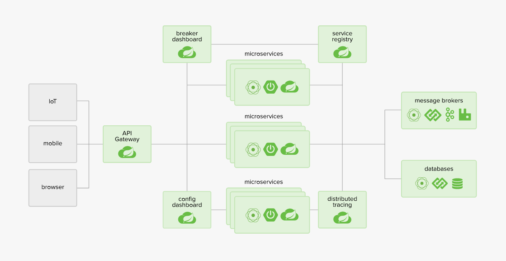
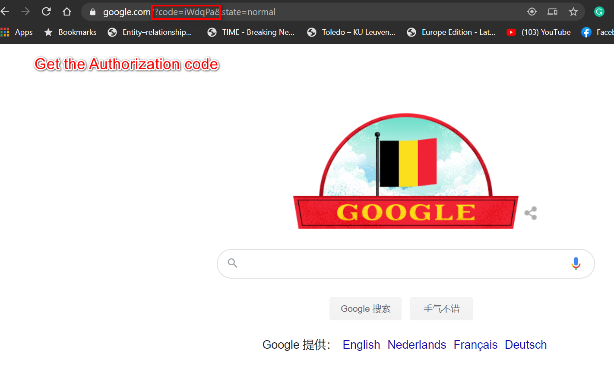
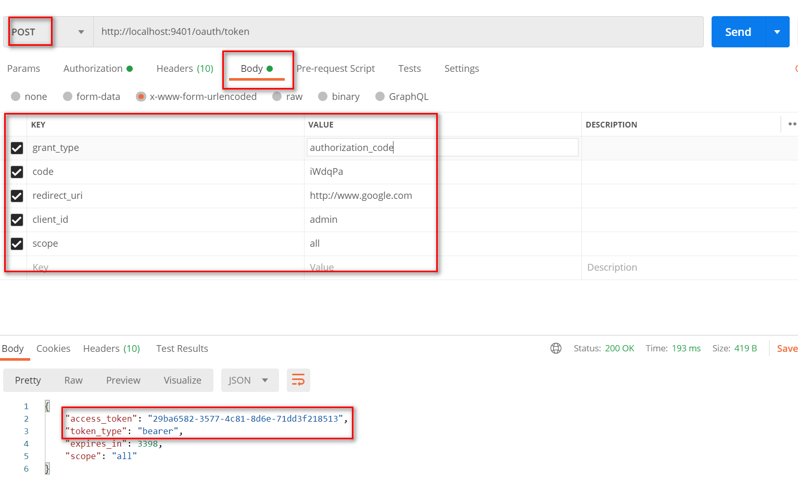
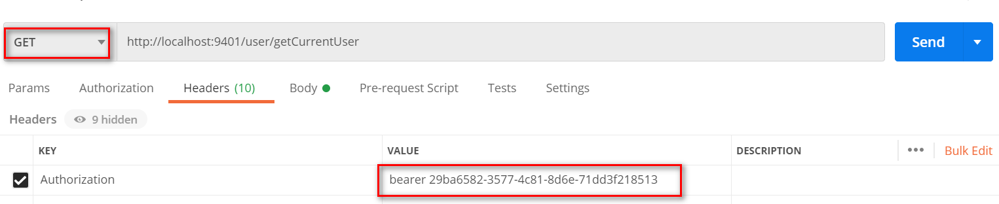
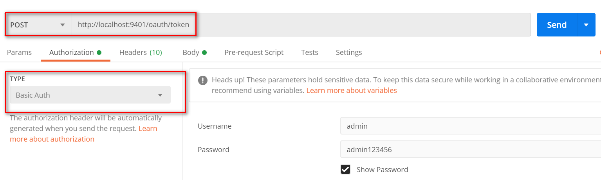
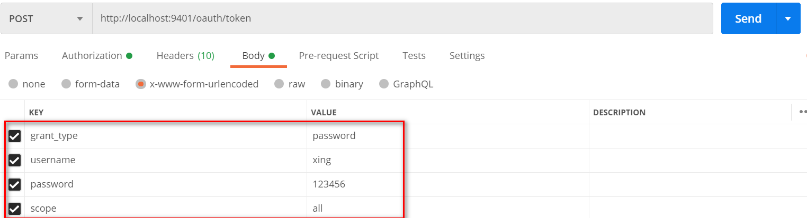

# springCloud

 

## OAuth2 modes
- Authorization Code
- Implicit
- Resource Owner Password Credentials
- Authorization server

#### How to use the Authorization Code mode
- Run oauth2-server
- Type in this url in your browser: http://localhost:9401/oauth/authorize?response_type=code&client_id=admin&redirect_uri=http://www.google.com&scope=all&state=normal 
- Enter name and password based on your UserService
 

 
**- Today is Belgian Nationale feestdag :)**
- Open Postman type in like below and send, Authorization Server will return the **_Access Token_**
 
- Now if you visit http://localhost:9401/user/getCurrentUser, it will notify need full authorization. Add access token in **Headers.** Then we can access. 
 

#### How to use the Resource Owner Password Credentials mode
- Run postman, TYPE: chose the **_Basic Auth_**, type in the username and password based on your **_AuthorizationServerConfig_**
 
- Add the parameters like below, post to get **_Access Token_**
 

